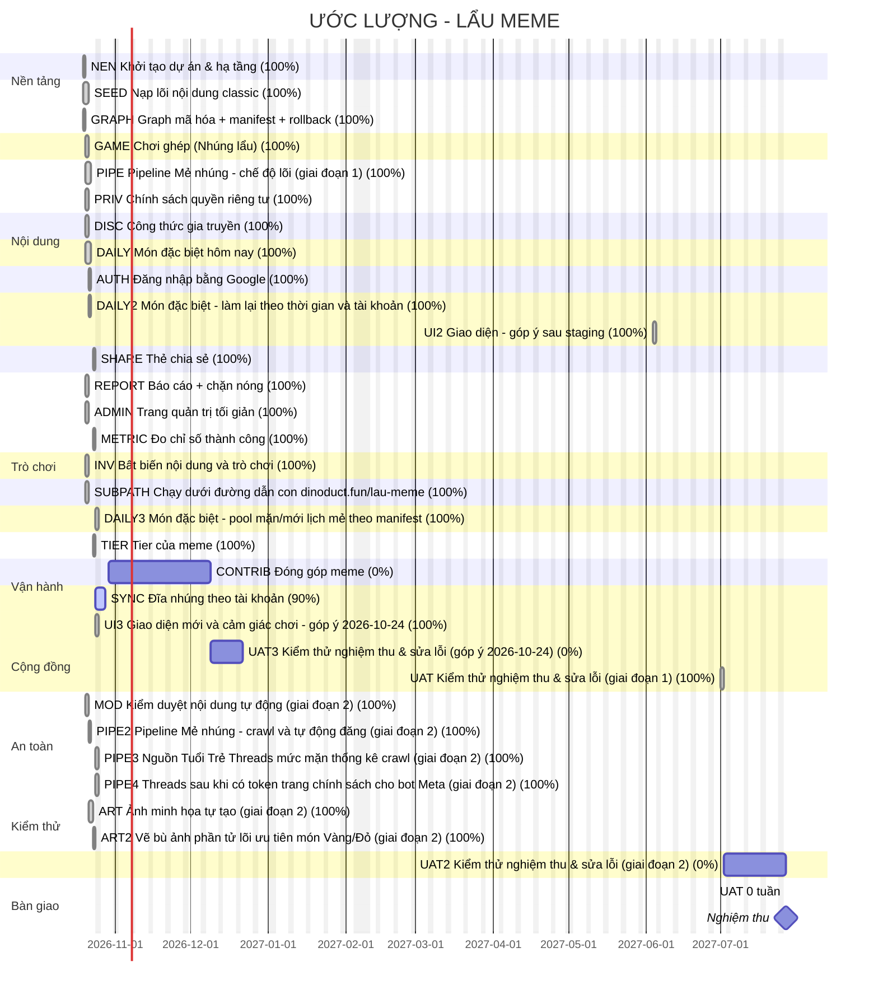

# Gantt - ƯỚC LƯỢNG - LẨU MEME

Tiến độ 89% · nghiệm thu KH 2028-06-06 · dự báo 2027-07-27. Bản tương tác: `gantt.html`.

```mermaid
gantt
    title ƯỚC LƯỢNG - LẨU MEME
    dateFormat YYYY-MM-DD
    excludes weekends, 2027-01-01, 2027-02-04, 2027-02-05, 2027-02-06, 2027-02-07, 2027-02-08, 2027-02-09, 2027-02-10, 2027-04-30, 2027-05-01, 2027-09-02
    todayMarker stroke-width:2px,stroke:#d33
    section Nền tảng
    NEN Khởi tạo dự án & hạ tầng (100%) :done, NEN, 2026-10-19, 1d
    section Nội dung
    SEED Nạp lõi nội dung classic (100%) :done, SEED, 2026-10-19, 2d
    GRAPH Graph mã hóa + manifest + rollback (100%) :done, GRAPH, 2026-10-19, 1d
    section Trò chơi
    GAME Chơi ghép (Nhúng lẩu) (100%) :done, GAME, 2026-10-20, 1d
    section Nội dung
    PIPE Pipeline Mẻ nhúng - chế độ lõi (giai đoạn 1) (100%) :done, PIPE, 2026-10-20, 2d
    section Vận hành
    PRIV Chính sách quyền riêng tư (100%) :done, PRIV, 2026-10-20, 1d
    section Cộng đồng
    DISC Công thức gia truyền (100%) :done, DISC, 2026-10-20, 1d
    section Trò chơi
    DAILY Món đặc biệt hôm nay (100%) :done, DAILY, 2026-10-20, 2d
    section Cộng đồng
    AUTH Đăng nhập bằng Google (100%) :done, AUTH, 2026-10-21, 1d
    section Trò chơi
    DAILY2 Món đặc biệt - làm lại theo thời gian và tài khoản (100%) :done, DAILY2, 2026-10-21, 1d
    UI2 Giao diện - góp ý sau staging (100%) :done, UI2, 2027-06-04, 1d
    section Cộng đồng
    SHARE Thẻ chia sẻ (100%) :done, SHARE, 2026-10-23, 1d
    section An toàn
    REPORT Báo cáo + chặn nóng (100%) :done, REPORT, 2026-10-20, 1d
    ADMIN Trang quản trị tối giản (100%) :done, ADMIN, 2026-10-20, 1d
    section Vận hành
    METRIC Đo chỉ số thành công (100%) :done, METRIC, 2026-10-23, 1d
    section Kiểm thử
    INV Bất biến nội dung và trò chơi (100%) :done, INV, 2026-10-20, 1d
    section Nền tảng
    SUBPATH Chạy dưới đường dẫn con dinoduct.fun/lau-meme (100%) :done, SUBPATH, 2026-10-20, 1d
    section Trò chơi
    DAILY3 Món đặc biệt - pool mặn/mới  lịch mẻ theo manifest (100%) :done, DAILY3, 2026-10-24, 1d
    section Nội dung
    TIER Tier của meme (100%) :done, TIER, 2026-10-23, 1d
    section Cộng đồng
    CONTRIB Đóng góp meme (0%) :CONTRIB, 2026-10-29, 29d
    section Trò chơi
    SYNC Đĩa nhúng theo tài khoản (90%) :active, SYNC, 2026-10-24, 3d
    UI3 Giao diện mới và cảm giác chơi - góp ý 2026-10-24 (100%) :done, UI3, 2026-10-24, 1d
    section Kiểm thử
    UAT3 Kiểm thử nghiệm thu & sửa lỗi (góp ý 2026-10-24) (0%) :UAT3, 2026-12-09, 9d
    UAT Kiểm thử nghiệm thu & sửa lỗi (giai đoạn 1) (100%) :done, UAT, 2027-07-01, 1d
    section Nội dung
    MOD Kiểm duyệt nội dung tự động (giai đoạn 2) (100%) :done, MOD, 2026-10-20, 1d
    PIPE2 Pipeline Mẻ nhúng - crawl và tự động đăng (giai đoạn 2) (100%) :done, PIPE2, 2026-10-21, 1d
    PIPE3 Nguồn Tuổi Trẻ  Threads  mức mặn  thống kê crawl (giai đoạn 2) (100%) :done, PIPE3, 2026-10-24, 1d
    PIPE4 Threads sau khi có token  trang chính sách cho bot Meta (giai đoạn 2) (100%) :done, PIPE4, 2026-10-24, 1d
    ART Ảnh minh họa tự tạo (giai đoạn 2) (100%) :done, ART, 2026-10-21, 2d
    ART2 Vẽ bù ảnh phần tử lõi  ưu tiên món Vàng/Đỏ (giai đoạn 2) (100%) :done, ART2, 2026-10-23, 1d
    section Kiểm thử
    UAT2 Kiểm thử nghiệm thu & sửa lỗi (giai đoạn 2) (0%) :UAT2, 2027-07-02, 17d
    section Bàn giao
    UAT 0 tuần :uat, 2027-07-27, 0d
    Nghiệm thu :milestone, 2027-07-27, 0d
```
