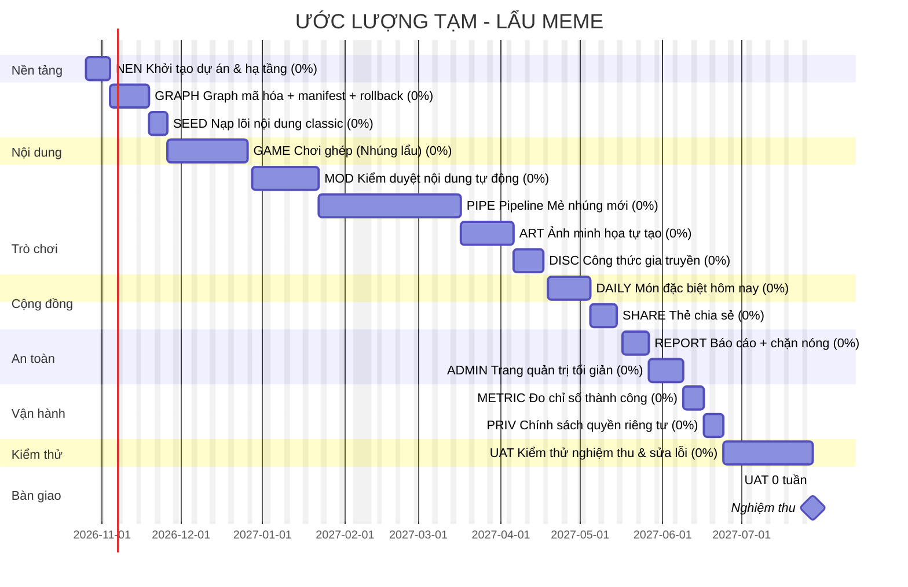

# Gantt — ƯỚC LƯỢNG TẠM - LẨU MEME

Tiến độ 0% · nghiệm thu KH 2027-07-28 · dự báo 2027-07-28. Bản tương tác: `gantt.html`.

```mermaid
gantt
    title ƯỚC LƯỢNG TẠM - LẨU MEME
    dateFormat YYYY-MM-DD
    excludes weekends, 2027-01-01, 2027-02-04, 2027-02-05, 2027-02-06, 2027-02-07, 2027-02-08, 2027-02-09, 2027-02-10, 2027-04-30, 2027-05-01, 2027-09-02
    todayMarker stroke-width:2px,stroke:#d33
    section Nền tảng
    NEN Khởi tạo dự án & hạ tầng (0%) :NEN, 2026-10-26, 7d
    section Nội dung
    GRAPH Graph mã hóa + manifest + rollback (0%) :GRAPH, 2026-11-04, 11d
    SEED Nạp lõi nội dung classic (0%) :SEED, 2026-11-19, 5d
    section Trò chơi
    GAME Chơi ghép (Nhúng lẩu) (0%) :GAME, 2026-11-26, 22d
    section Nội dung
    MOD Kiểm duyệt nội dung tự động (0%) :MOD, 2026-12-28, 18d
    PIPE Pipeline Mẻ nhúng mới (0%) :PIPE, 2027-01-22, 33d
    ART Ảnh minh họa tự tạo (0%) :ART, 2027-03-17, 14d
    section Cộng đồng
    DISC Công thức gia truyền (0%) :DISC, 2027-04-06, 9d
    section Trò chơi
    DAILY Món đặc biệt hôm nay (0%) :DAILY, 2027-04-19, 11d
    section Cộng đồng
    SHARE Thẻ chia sẻ (0%) :SHARE, 2027-05-05, 8d
    section An toàn
    REPORT Báo cáo + chặn nóng (0%) :REPORT, 2027-05-17, 8d
    ADMIN Trang quản trị tối giản (0%) :ADMIN, 2027-05-27, 9d
    section Vận hành
    METRIC Đo chỉ số thành công (0%) :METRIC, 2027-06-09, 6d
    PRIV Chính sách quyền riêng tư (0%) :PRIV, 2027-06-17, 5d
    section Kiểm thử
    UAT Kiểm thử nghiệm thu & sửa lỗi (0%) :UAT, 2027-06-24, 24d
    section Bàn giao
    UAT 0 tuần :uat, 2027-07-28, 0d
    Nghiệm thu :milestone, 2027-07-28, 0d
```
