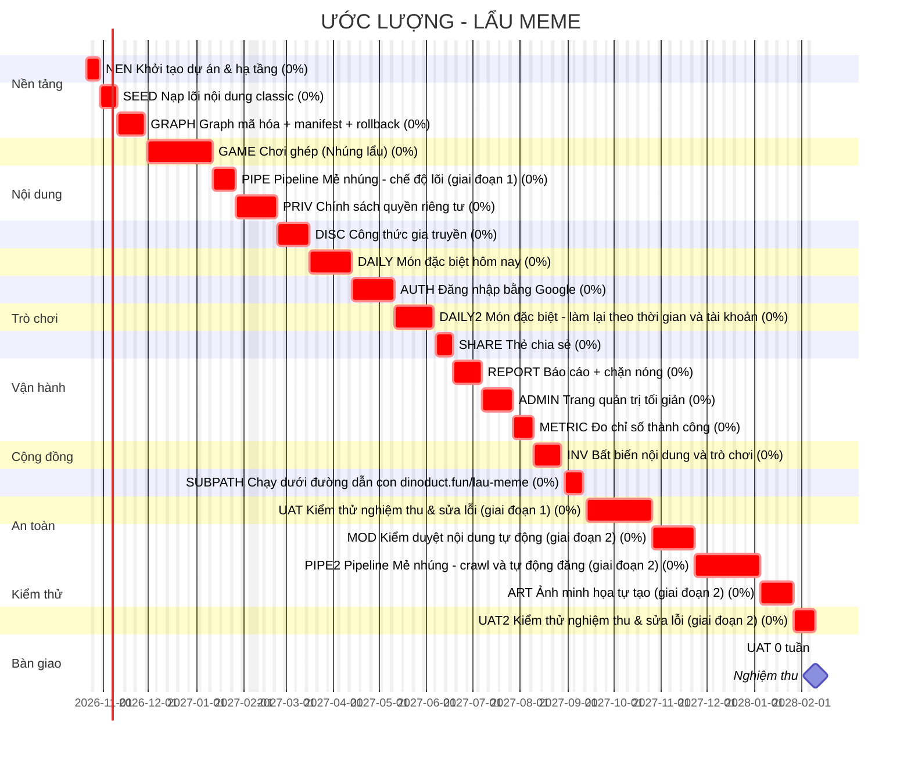

# Gantt — ƯỚC LƯỢNG - LẨU MEME

Tiến độ 0% · nghiệm thu KH 2027-11-23 · dự báo 2028-02-10. Bản tương tác: `gantt.html`.

```mermaid
gantt
    title ƯỚC LƯỢNG - LẨU MEME
    dateFormat YYYY-MM-DD
    excludes weekends, 2027-01-01, 2027-02-04, 2027-02-05, 2027-02-06, 2027-02-07, 2027-02-08, 2027-02-09, 2027-02-10, 2027-04-30, 2027-05-01, 2027-09-02, 2028-01-01
    todayMarker stroke-width:2px,stroke:#d33
    section Nền tảng
    NEN Khởi tạo dự án & hạ tầng (0%) :crit, NEN, 2026-10-21, 7d
    section Nội dung
    SEED Nạp lõi nội dung classic (0%) :crit, SEED, 2026-10-30, 7d
    GRAPH Graph mã hóa + manifest + rollback (0%) :crit, GRAPH, 2026-11-10, 14d
    section Trò chơi
    GAME Chơi ghép (Nhúng lẩu) (0%) :crit, GAME, 2026-11-30, 30d
    section Nội dung
    PIPE Pipeline Mẻ nhúng - chế độ lõi (giai đoạn 1) (0%) :crit, PIPE, 2027-01-12, 11d
    section Vận hành
    PRIV Chính sách quyền riêng tư (0%) :crit, PRIV, 2027-01-27, 14d
    section Cộng đồng
    DISC Công thức gia truyền (0%) :crit, DISC, 2027-02-23, 15d
    section Trò chơi
    DAILY Món đặc biệt hôm nay (0%) :crit, DAILY, 2027-03-16, 20d
    section Cộng đồng
    AUTH Đăng nhập bằng Google (0%) :crit, AUTH, 2027-04-13, 19d
    section Trò chơi
    DAILY2 Món đặc biệt - làm lại theo thời gian và tài khoản (0%) :crit, DAILY2, 2027-05-11, 19d
    section Cộng đồng
    SHARE Thẻ chia sẻ (0%) :crit, SHARE, 2027-06-07, 9d
    section An toàn
    REPORT Báo cáo + chặn nóng (0%) :crit, REPORT, 2027-06-18, 13d
    ADMIN Trang quản trị tối giản (0%) :crit, ADMIN, 2027-07-07, 14d
    section Vận hành
    METRIC Đo chỉ số thành công (0%) :crit, METRIC, 2027-07-27, 10d
    section Kiểm thử
    INV Bất biến nội dung và trò chơi (0%) :crit, INV, 2027-08-10, 14d
    section Nền tảng
    SUBPATH Chạy dưới đường dẫn con dinoduct.fun/lau-meme (0%) :crit, SUBPATH, 2027-08-30, 9d
    section Kiểm thử
    UAT Kiểm thử nghiệm thu & sửa lỗi (giai đoạn 1) (0%) :crit, UAT, 2027-09-13, 31d
    section Nội dung
    MOD Kiểm duyệt nội dung tự động (giai đoạn 2) (0%) :crit, MOD, 2027-10-26, 20d
    PIPE2 Pipeline Mẻ nhúng - crawl và tự động đăng (giai đoạn 2) (0%) :crit, PIPE2, 2027-11-23, 31d
    ART Ảnh minh họa tự tạo (giai đoạn 2) (0%) :crit, ART, 2028-01-05, 16d
    section Kiểm thử
    UAT2 Kiểm thử nghiệm thu & sửa lỗi (giai đoạn 2) (0%) :crit, UAT2, 2028-01-27, 10d
    section Bàn giao
    UAT 0 tuần :uat, 2028-02-10, 0d
    Nghiệm thu :milestone, 2028-02-10, 0d
```
